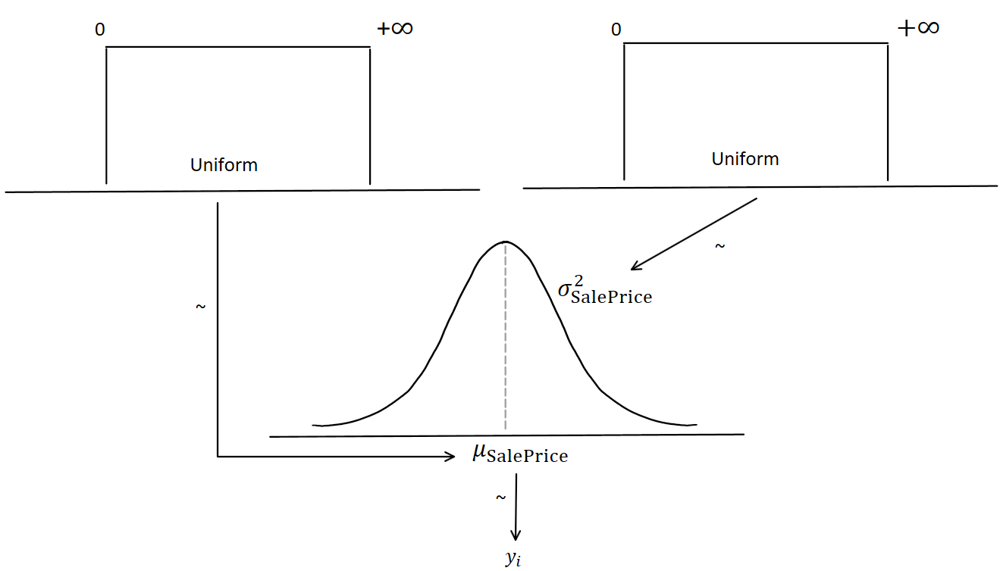

```{r, warning=F, message=F, echo=T}

packages <- c("tidyverse",
              "ggplot2",
              "rmarkdown",
              "knitr",
              "kableExtra",
              "purrr",
              "scales",
              "rjags",
              "runjags",
              "coda",
              "readr",
              "beepr")

lapply(packages, library, character.only=T)

# Data
PropertyPrices <- read_csv("Assignment2PropertyPrices.csv")

PropertyPrices$SalePrice <- as.numeric(PropertyPrices$SalePrice)

```

## Part A

### Model Diagram Parameters

```{r, fig.width=10, fig.height=7, warning=F, message=F, echo=T}

PropertyPrices %>% summarise("Mean Sale Price" = mean(SalePrice),
                             "Sale Price Var" = var(SalePrice),
                             "Sale Price SD" = sd(SalePrice),
                             "Min Sale Price" = min(SalePrice),
                             "Max Sale Price" = max(SalePrice),
                             "n Observations" = n()) %>% 
  gather(key="Measure",
         value="Value") %>% 
  kable(align="lr", "html",
        format.args = list(trim=F,
                           digits=1,
                           nsmall=1,
                           scientific=F,
                           big.mark=" ")) %>% 
  kable_styling(full_width=F,
                bootstrap_options=)

# Sale price hist
ggplot(PropertyPrices, aes(x=SalePrice)) +
  geom_histogram(aes(fill=factor(PropertyPrices$PropertyType,
                                    labels=c("House", "Unit"))),
                 col="white",
                 bins=40,
                 alpha=2/3) +
  scale_x_continuous("Sale Price (AUD)",
                     labels=dollar) +
  scale_y_continuous("Number of Properties",
                     label=comma) + 
  scale_fill_manual("Property Type",
                    values=c("blue3", "cyan3")) +
  ggtitle("Sale Price Histogram") +
  theme_minimal()

```

`SalePrice` is right-skewed and not normally distributed. However, as \(n=10,000\), CLT can be assumed and that distribution of sampling means would be Gaussian. As such, the Bayesian model diagram is:



### JAGS Data and Model blocks

```{r, warning=F, message=F, echo=T}

vectSalePrice <- PropertyPrices$SalePrice
nTotal <- length(vectSalePrice)

dataList <- list(
  vectSalePrice = vectSalePrice,
  nTotal = nTotal
)

var(vectSalePrice)


modelString <- c("
model {
  for (i in 1:nTotal) {
    vectSalePrice[i] ~ dnorm(mu, tau)
  }
  mu ~ dnorm(609360.2, tau)
  tau ~ dgamma(609360.2, 1/262475685684)
}
"
)


writeLines(modelString, con="normJAGSmodel.txt")

```

### Compile Model and run Markov Chains


```{r, warning=F, message=F, echo=T}

jagsModel <- jags.model(file="normJAGSmodel.txt",
                        data=dataList,
                        n.chains=3,
                        n.adapt=500
                        )

update(jagsModel,
       n.iter=500)

codaSamples <- coda.samples(jagsModel,
                            variable.names=c("mu"),
                            n.iter=3334
                            )

# Display MCMC diagnostics
diagMCMC(codaObject=codaSamples,
         parName="mu")

# Display the posterior distribution of mu
plotPost(codaSamples[,"mu"],
          main="mu",
          xlab=bquote(mu)
         )

beep(2)

```


