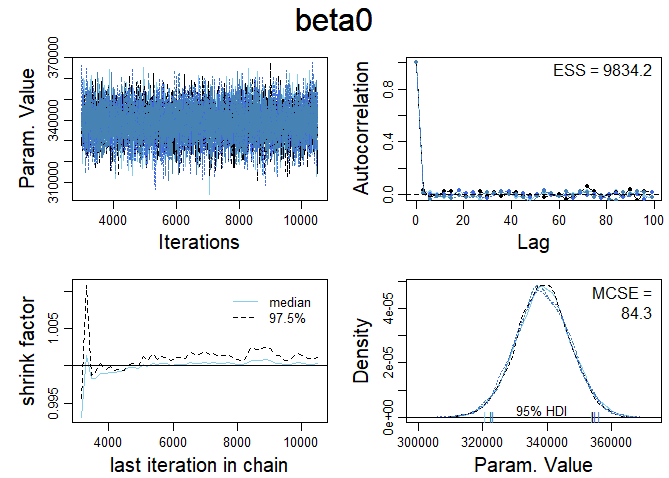
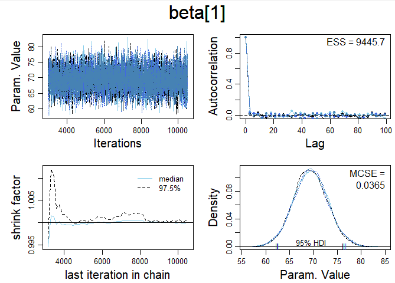
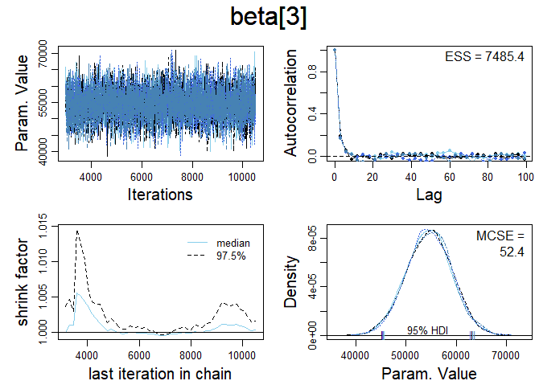
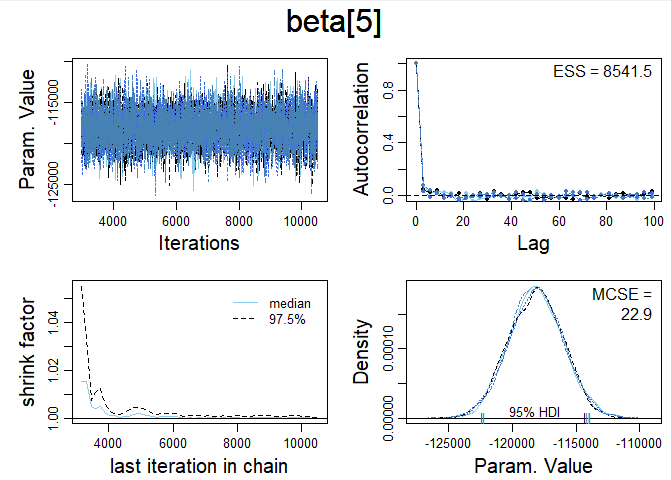
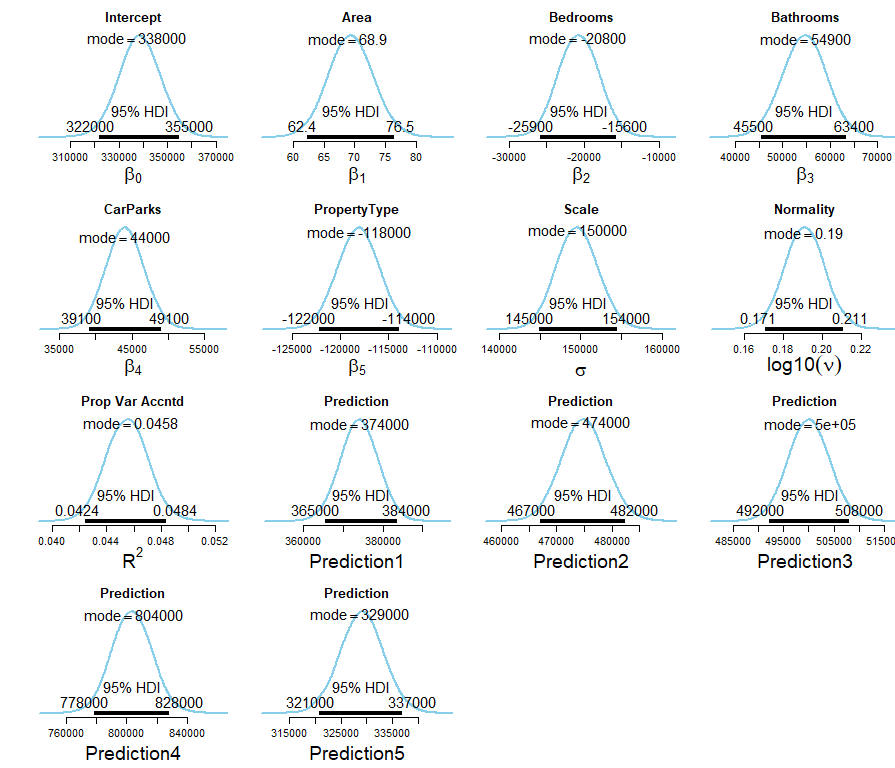

### Data and Packages

```{r, echo=T, message=F, warning=F, results='hide'}

packages <- c("tidyverse",
              "ggplot2",
              "rmarkdown",
              "knitr",
              "kableExtra",
              "purrr",
              "scales",
              "rjags",
              "runjags",
              "coda",
              "readr",
              "beepr",
              "grid",
              "gridExtra")

lapply(packages, library, character.only=T)

source("DBDA2E-utilities.R")

# Data
PropertyPrices <- read_csv("Assignment2PropertyPrices.csv")

PropertyPrices$SalePrice <- as.numeric(PropertyPrices$SalePrice)

```

# **Part A**

### Model Diagram Parameters

```{r, fig.width=10, fig.height=7, warning=F, message=F, echo=T}

PropertyPrices %>% summarise("Mean Sale Price" = mean(SalePrice),
                             "Sale Price Var" = var(SalePrice),
                             "Sale Price SD" = sd(SalePrice),
                             "Min Sale Price" = min(SalePrice),
                             "Max Sale Price" = max(SalePrice),
                             "n Observations" = n()) %>% 
  gather(key="Measure",
         value="Value") %>% 
  kable(align="lr", "html",
        format.args = list(trim=F,
                           digits=1,
                           nsmall=1,
                           scientific=F,
                           big.mark=" ")) %>% 
  kable_styling(full_width=F,
                bootstrap_options=)

# Sale price hist
ggplot(PropertyPrices, aes(x=SalePrice)) +
  geom_histogram(aes(fill=factor(PropertyPrices$PropertyType,
                                    labels=c("House", "Unit"))),
                 col="white",
                 bins=40,
                 alpha=2/3) +
  scale_x_continuous("Sale Price (AUD)",
                     labels=dollar) +
  scale_y_continuous("Number of Properties",
                     label=comma) + 
  scale_fill_manual("Property Type",
                    values=c("blue3", "cyan3")) +
  ggtitle("Sale Price Histogram") +
  theme_minimal()

```

`SalePrice` is right-skewed and not normally distributed. However, as \(n=10,000\), CLT can be assumed and that distribution of sampling means would be Gaussian. As such, the Bayesian model diagram is:


### JAGS Data and Model blocks

```{r, warning=F, message=F, echo=T}

vectSalePrice <- PropertyPrices$SalePrice
nTotal <- length(vectSalePrice)

dataList <- list(
  vectSalePrice = vectSalePrice,
  nTotal = nTotal
)

var(vectSalePrice)


modelString <- c("
model {
  # priors
  mu ~ dnorm(609360.2, tau)
  tau ~ dgamma(0.001, 1/(262475685684))

  # likelihood
  for (i in 1:nTotal) {
    vectSalePrice[i] ~ dnorm(mu, tau)
  }
}
"
)


writeLines(modelString, con="normJAGSmodel.txt")

```

### Compile Model and run Markov Chains


```{r, warning=F, message=F, echo=T, fig.width=10, fig.height=8}

jagsModel <- jags.model(file="normJAGSmodel.txt",
                        data=dataList,
                        n.chains=5,
                        n.adapt=150
                        )

update(jagsModel,
       n.iter=500)

codaSamples <- coda.samples(jagsModel,
                            variable.names=c("mu"),
                            n.iter=2500
                            )

# beep(2)

# Display MCMC diagnostics
diagMCMC(codaObject=codaSamples,
         parName="mu")

# Display the posterior distribution of mu
plotPost(codaSamples[,"mu"],
          main="mu",
          xlab=bquote(mu)
         )

```

### Interpretation

#### Chain Representativeness

The chains all seem to have settled about \(\bar{x}\approx 610\ 000\). The chains seem to mix well, with most values of each iteration being between \(590\ 000\) and \(630\ 000\). After the burn-in period, the chains can be seen in the smoothed density plot to overlap well. The shrink factor can also be observed to be very close to one after the burn-in period. The \(95\%\) High Density Interval is \((598\ 981.1, 618\ 939.5)\), with a mode of \(609 000\).

#### Chain Accuracy

The *Effective Sample Size* is the same length of the chain \((ESS=12\ 500)\) and the *Monte Carlo standard error* \((MCSE\approx46.2)\) is somewhat low compared to \(\bar{x}\approx 609\ 000\) and the \(ESS\). Considering the *Effective Sample Size* adn the *Monte Carlo standard error*, it can be suggested that the chains are accurate represenations of the posterior probability distribution.


# **Part B**

### Regression Model

The following expert knowledge has been provided for the predictor variables of the data set, which allows for prior distributions to be defined:
"
* Area: Every m2 increase in land size increases the sales price by 90 AUD. This is a very strong expert knowledge.
* Bedrooms: Every additional bedroom increases the sales price by 100,000AUD. This is a weak expert knowledge.
* Bathrooms: There is no expert knowledge on the number of bathrooms.
* CarParks: Every additional car space increases the sales price by 120,000AUD. This is a strong expert knowledge.
* PropertyType: If the property is a unit, the sale price will be 150,000 AUD less than that of a house on the average. This is a very strong expert knowledge.
"

These prior distributions will be used in the multiple linear regression equation
$$\mu= \beta_0 + \beta_j X_j$$
Over five predictor variables, this equation can be specified as:
$$\mu=\beta_0+\beta_1X_1+\beta_2X_2+\beta_3X_3+\beta_4X_4+\beta_5X_5$$, which can be modelled as:


With the distributions of predictors (denoted \(\boldsymbol{j}\) in the model diagram above) defined per predictor as:

1. Area:
$$\beta_1 = j\sim N\left(\mu=90, \tau=\left(\frac{1}{\sigma_y^2}\right)\times0.01\right)$$

2. Bedrooms:
$$\beta_2 =j\sim N\left(\mu=100\ 000,\tau=\left(\frac{1}{\sigma_y^2} \right)\times0.75 \right)$$

3. Bathrooms
$$\beta_3 =j\sim N\left(\mu=609\ 360.2,\tau=\left(\frac{1}{\sigma_y^2}\right) \times100 \right)$$
```{r, collapse=T}
# mean of SalePrice
mean(PropertyPrices$SalePrice) %>% format(big.mark=" ")
```

4. CarParks:
$$\beta_4=j\sim N\left(\mu=120\,000,\tau=\left(\frac{1}{\sigma_y^2}\right) \times0.1\right)$$

5. PropertyType:
$$\beta_5 = j\sim N\left(\mu=150\ 000, \tau=\left(\frac{1}{\sigma_y^2}\right)\times 0.01\right)$$

#### Data and Model Block

```{r}

  modelString = "
  # Standardize the data:
  data {
    ym <- mean(y)
    ysd <- sd(y)
    for ( i in 1:Ntotal ) {
      zy[i] <- ( y[i] - ym ) / ysd
    }
    for ( j in 1:Nx ) {
      xm[j]  <- mean(x[,j])
      xsd[j] <-   sd(x[,j])
      for ( i in 1:Ntotal ) {
        zx[i,j] <- ( x[i,j] - xm[j] ) / xsd[j]
      }
    }

    # Prior mus
    mu0 <- ym # Set to overall mean a priori based on the interpretation of constant term in regression
    mu[1] <- 90 # Area
    mu[2] <- 100000 # Bedrooms
    mu[3] <- 609360.2 # Bathrooms, muY
    mu[4] <- 120000 # CarParks
    mu[5] <- 0.5 # PropertyType

    # Prior taus   
    Var0 <- (1/(ysd^2))
    Var[1] <- ((ysd^2)*0.01) # Area
    Var[2] <- ((ysd^2)*0.75) # Bedrooms
    Var[3] <- ((ysd^2)*100) # Bathrooms
    Var[4] <- ((ysd^2)*0.1) # CarParks
    Var[5] <- ((ysd^2)*0.01) # PropertyType

    # Standardising mus
    muZ[1:Nx] <-  mu[1:Nx] * xsd[1:Nx] / ysd 

    muZ0 <- (mu0 + sum( mu[1:Nx] * xm[1:Nx] / xsd[1:Nx] )*ysd - ym) / ysd 

    # Standardising taus
    VarZ[1:Nx] <- Var[1:Nx] * ( xsd[1:Nx]/ ysd )^2
    VarZ0 <- Var0 / (ysd^2)

  }
  # Specify the model for standardized data:
  model {
    for ( i in 1:Ntotal ) {
      zy[i] ~ dt( zbeta0 + sum( zbeta[1:Nx] * zx[i,1:Nx] ) , 1/zsigma^2 , nu )
    }

    # Priors vague on standardized scale:
    zbeta0 ~ dnorm( muZ0 , 1/VarZ0 )  
    for ( j in 1:Nx ) {
      zbeta[j] ~ dnorm( muZ[j] , 1/VarZ[j] )
    }
    zsigma ~ dgamma(0.01,0.01)#dunif( 1.0E-5 , 1.0E+1 )
    nu ~ dexp(1/30.0)

    # Transform to original scale:
    beta[1:Nx] <- ( zbeta[1:Nx] / xsd[1:Nx] )*ysd
    beta0 <- zbeta0*ysd  + ym - sum( zbeta[1:Nx] * xm[1:Nx] / xsd[1:Nx] )*ysd
    sigma <- zsigma*ysd

    # Compute predictions at every step of the MCMC
    # pred <- beta0 + beta[1] * xPred[1] + beta[2] * xPred[2] + beta[3] * xPred[3] + beta[4] * xPred[4] 
    #         + beta[5] * xPred[5] + beta[6] * xPred[6] + beta[7] * xPred[7] 

  }
  "

```


### Standardising the Data

To reduce the autocorrelation of the regression model parameters, particularly \(\beta_0\) & \(\beta_1\), the data needs to be standardised as follows: 

$$z_{\hat{y}}=\zeta_0 SD_y +M_y -SD_y \left(\sum_{j=1} \zeta_j \frac{M_{x_{j}}}{SD_{x_{j}}} + \sum_j \left(\zeta{_j} \frac{SD_y}{SD_{x_{j}}}\right) \right)$$

The model block above uses this method to standardise the data for \(\beta_0\) and each \(\beta_j\) predictor.


```{r}

# parameterNames = varnames(mcmcCoda)
# 
# for ( parName in parameterNames ) {
#   diagMCMC( codaObject=mcmcCoda , parName=parName , 
#             saveName=fileNameRoot , saveType=graphFileType 
#             )
# }

```


```{r}
# plotMCMC( mcmcCoda , data=myData , xName=xName , yName=yName , 
#           pairsPlot=TRUE , showCurve=TRUE ,
#           saveName=fileNameRoot , saveType=graphFileType )

```

### Assessing the Chains


<br />
Autocorrelation for $\beta_0$ is low, but has not resulted in an *Effective Sample Size* $(ESS\approx7000)$ that is the full length of the chain (10 000 iterations). The shrink factor shows the chains converge well for $\beta_0$ and approach $1.0$. The smoothed density plots show the chains overlap well. As such, it can be stated that posterior distribution of $beta_0$ is moderately-well respresented by the MCMC simulation. Further thinning of the chains might help to lower the *Effective Sample Size*


<br />
The *Effective Sample Size* $(ESS\approx9000)$ is closer to the full length of the chain (10 000 iterations) for $\beta_1$ compared to $\beta_0$.  Just like with $\beta_0$, the chains for $\beta_1$ could have their *Effective Sample Size* increased by further thinning.

Despite the very strong prior knowledge stating that for every square metre increase in a plot of land equates to a \$90 increase in Sale Price, the chains all hover around $\bar{x}\approx 58$. This indicates that even though the prior distribution was centred at $\mu=90$ - with quite a small variance (or, conversely, a high precision $(\tau)$) implying high certainty of the estimate - that the sampling likelihood distribution was able to override this estimate and reduce its value for $\mu$ in the posterior distribution.

The shrink factor for $\beta_1$ approaches 1.0, and the smoothed density plots of the chains can be seen to overlap well. As such, the chains can be asserted to have mixed well and are representative of an appropriately modelled posterior distribution.


<br />
The *Effective Sample Size* $(ESS\approx 5250)$ for $\beta_2$ is quite low compared to the full length of the chain. The *Lag* plot indicates that further thinning, approximately 8-10, would improve the $ESS$ of the MCMC simulation.

Weak expert information was provided for $\beta_2$, which was that Sale Price increases by \$100 000 for each increase in the number of bedrooms. As this weak information was allocated a low precision $(\tau)$, the sampling likelihood distribution has reduced the estimated in the posterior distribution to $\mu \approx 10\ 000$. The shrink factor is below 1.2 for every iteration in the chain after the burn-in period and approaches 1.0, but is high in the first $\approx 4\ 000$ iterations of the chain compared to $\beta_0$ and $\beta_1$. The smoothed density plots appear to overlap well, and so the chains can be said to be moderately appropriate representations of the posterior distribution for $\beta_2$.


<br />
**No expert knowledge** was provided for $\beta_3$. As such, values from the likelihood distribution $\mu_{SalePrice}=609\ 360.2$ and $\sigma_y$ were assigned to $\bar{x}$ and $\sigma_3$ (respectively) in the model for estimating the prior distribution of $\beta_3$. Therefore, this weak prior was overpowered by the sampling likelihood distribution to provide $\mu_3 \approx 47\ 500$.

The *Effective Sample Size* $(ESS \approx 6750)$ is too short compared to the full length of the chain (10 000 iterations), and could be improved by further thinning. The Shrink factor for $\beta_3$ is well below 1.2 for all iterations after the burn-in stage and approaches 1.0. The smoothed density plot shows that all the chains mix well. As such, the chains can be asserted to be moderately representative of the posterior distribution.


<br />
The *Effective Sample Size* $(ESS\approx 8000)$ for $\beta_4$ is somewhat close to the full length of the chain (10 000 iterations), but still is not equal. As such, further thinning will be of benefit,

Strong expert knowledge was provided for $\beta_4$, which was that every increase in Car Parks would result in a \$120 000 increase in Sale Price. Again, despite the strong prior knowledge provided, the sampling likelihood distribution has overridden the prior distribution. As such, the posterior distribution is centred around $\approx 8000$, with the HDI ranging from $\approx 4000$ to $\approx 14\ 500$.

The shrink factor is well below 1.2 for all iterations of the chain after the burn-in period and approaches 1.0. The smoothed density plot shows that the chains overlap, which indicates they have mixed well. As such, it can be asserted that the chains are suitably representative of the posterior distribution.


<br />
The very strong prior knowledge provided for $\beta_5$ was that if a property is a unit, it will sell for \$150 000 less on average as compared to houses. As houses were encoded as 0 and units were encoded as 1 in the data set, -150 000 was assigned to the estimate of centrality for the prior distribution.

The strong prior knowledge was overridden by the sampling likelihood distribution again, which resulted in the posterior estimate of $\beta_5 \approx -25\ 00$, with a High Density Interval of between $\approx -33\ 000$ and $\approx -16\ 000$.

The *Effective Sample Size* $(ESS\approx 6800)$ was too short when compared to the full length of the MCMC chain (10 000 iterations), and so could benefit from further thinning. The shrink factor was below 1.2 for all iterations of the chain after the burn-in period and approached 1.0. The smoothed density plot showed that the chains overlapped and indicated that they mixed well. As such, it can be said that the MCMC chains were suitably representative of the posterior distribution.


### Assessing the Posterior Distributions
<br />

<br />

#### $\bf{\beta_0}$ Posterior Distribution - y-Intercept
The posterior distribution for the intercept had a HDI of {257 000, 293 000} and a mode of 277 000. Despite this HDI not comprising 0, it could be argued that it does not accurately reflect the likelihood distribution of the data as the minimum SalePrice was \$200 000. This possibly indicates that setting the mean of the prior distribution for $\beta_0$ to equal the mean of the likelihood distribution was inappropriate. The mean for the distribution of $\beta_0$ should have been no greater than the minimum of the likelihood of the sample. Moreover, it could be argued that a propery with no land Area, no Bedrooms, no Bathrooms, and no CarParks would sell for 0. As such, a value of either 0 or the minimum Sale Price observed in the sample would be a better choice than the average Sale Price from the sample.
<br /> <br />

#### $\bf{\beta_1}$ Posterior Distribution - Area
The posterior distribution for Area $(\beta_1)$ was centred around a mode of 59.6, with a very narrow HDI of {52.8, 65.7}. This high precision is in part caused by the very strong expert knowledge provided for the prior distribution, which similarly was allocated high precision. However, the likelihood distribution for $\beta_1$ would have needed to be similarly precise as well in order to produce a posterior distribution with high precision. Despite the estimate for $\beta_1$ having an estimate of $\mu=90$, the likelihood has moved the position of the posterior closer towards 0. This indicates that while the certainty of the prior distribution was similar to the precision of the likelihood distribution for the estimate of $\beta_1$, the estimates of centrality of the prior distribution did not match what was observed in the likelihood distribution.
<br /> <br />

#### $\bf{\beta_2}$ Posterior Distribution - Bedrooms
The posterior distribution for the estimate of $\beta_2$ was centred around 10 400, with a HDI of {4 800, 15 900}. This HDI is quite wide, which is caused by the wide prior distribution for the estimate of $\beta_2$. Similar to $\beta_1$, the posterior distribution was pulled towards 0 for $\beta_2$ as the prior was centred around 100 000. This difference between the prior mean and the posterior mode in the estimate for $\beta_2$ indicates that the expert knowledge was correct in stating that certainty for the prior was low.
<br /> <br />

#### $\bf{\beta_3}$ Posterior Distribution - Bathrooms
No prior knowledge was provided for the Bathrooms estimate of $\beta_3$. As such, the mean observed SalePrice from the sample was assigned to the mean of the prior distribution of the $\beta_3$, with an extremely low precision. Despite this, the likelihood distribution for Bathrooms must have been very precise as it has resulted in a relatively narrow HDI of {39 600, 56 100} centred around a mode of 48 500.
<br /> <br />

#### $\bf{\beta_4}$ Posterior Distribution - CarParks
The prior estimate of CarParks was provided with strong certainty. This strong certainty of the prior distribution was not reflected in the posterior distribution, which had a HDI of {4 040, 14 700} centred around a mode of 9 400.
<br /> <br />

#### $\bf{\beta_5}$ Posterior Distribution - Property Type
The prior distribution for the $\beta_5$ estimate of PropertyType was also provided with strong expert knowledge. This prior distribution of this strong knowledge was overridden by the likelihood distribution as the posterior distribution had a HDI of {-33 200, -16 700} centred around a mode of -25 200.
<br /> <br />

#### $R^2$ Posterior Distribution - Coefficient of Determination
The coefficient of determination for the multiple regression model had a HDI of {0.0297, 0.0349}, centred around a mode of 0.032. This posterior distribution of the estimate for $R^2$ is quite certain, and also extremely close to zero. As the coefficient of determination is so small, it can be asserted that there is no correlation between the multiple predictors provided and the dependent variable SalePrice. This is likely due to the influence of incorrectly setting the prior distribution for the estimate of $\beta_0$ to $\bar{x}_y$, which results in high magnitude residuals in the model.
<br /> <br />

#### Posterior Distributions - Predictions
As the $R^2 \approx 0$, each of the predictions of SalePrice cannot be determined with any certainty.
<br /> <br />

## Conclusion


